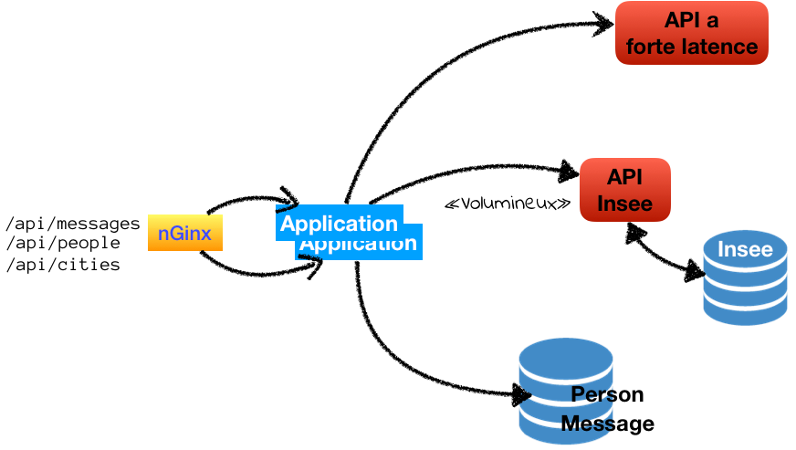

= cache-demo-source =

Demo (simple) accompagnant le presentation de la gestion du cache avec Spring

== _Introduction_ ==

L'application presente quelques URLs afin de valider la notion de cache.
Elle organise ses donnée depuis 2 tables décrite dans le container `app-db`.
Un accès HTTP simulant un accès long `ping-app`.
Et un autre accès HTTP revoyant des données relativement importante `zipcode-app` ayant sa propre base de donnée (`zipcode-db`).



Chaque utilisation est isolée dans une branche.

* ehCache in-memory
** url...
* ehCache distribué - serveur terracotta OSS
** https://github.com/ptitbob/cache-demo-source/tree/ehcache-distribue
* REDIS distribué - serveur REDIS
** https://github.com/ptitbob/cache-demo-source/tree/redis-distribue
* Hazelcast
** url...

Le load balancing sur les deux noeud de l'application est assué par un NGINX qui permet aussi d'acceder à pgAdmin.

Afin de permettre l'accès via nGinx, vous devez configurer votre Hosts :

```
# pour la demo spring cache
127.0.0.1   docker.local
fe80::1%lo0 pgadmin.docker.local
127.0.0.1   pgadmin.docker.local
fe80::1%lo0 glowroot.docker.local
127.0.0.1   glowroot.docker.local
fe80::1%lo0 zipcode.docker.local
127.0.0.1   zipcode.docker.local
fe80::1%lo0 ping.docker.local
127.0.0.1   ping.docker.local
fe80::1%lo0 app.docker.local
127.0.0.1   app.docker.local
```

== les URLs ==

L'application expose une serie d'URLs:

* Les message
** liste : GET http://app.docker.local/api/messages
** un message : GET http://app.docker.local/api/messages/(CODE)
** création : POST http://app.docker.local/api/messages
** suppression : DELETE http://app.docker.local/api/messages/(CODE)
** modification : PUT http://app.docker.local/api/messages/[CODE]

== ehCache in-memory ==

== ehCache distribué ==

== Redis distribué ==

Afin de verifier les accès au cache, `redis`offre un cli bien pratique.

Pour y acceder :

```
docker exec -it redis bash
```
Puis
```
redis-cli
```
Et maintenant le monitoring :
```
monitor
```

Lors d'un primo accès, vous devriez obtenir ceci:
```
1545659237.142891 [0 172.19.0.1:33824] "SET" "message::TOT" "\xac\xed\x00\x05sr\x00+org.shipstone.demo.cache.app.domain.MessageIT\xfb\xa1\xc7LF6\x02\x00\x03L\x00\x04codet\x00\x12Ljava/lang/String;L\x00\x02idt\x00\x10Ljava/lang/Long;L\x00\amessageq\x00~\x00\x01xpt\x00\x03TOTsr\x00\x0ejava.lang.Long;\x8b\xe4\x90\xcc\x8f#\xdf\x02\x00\x01J\x00\x05valuexr\x00\x10java.lang.Number\x86\xac\x95\x1d\x0b\x94\xe0\x8b\x02\x00\x00xp\x00\x00\x00\x00\x00\x00\x00[t\x00\x130+0=la t\xc3\xaate a toto" "PX" "6000"
1545659238.737308 [0 172.19.0.1:33824] "GET" "message::TOT"
```

et pour un accès sur une donnée déjà en cache:
```
1545659240.008038 [0 172.19.0.1:33824] "GET" "message::TOT"
```

https://redis.io/topics/rediscli[Liste des commandes redis-cli]

== Hazelcast ==

